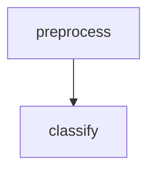

1. Install packages. `python -m pip install -r requirements.txt`

2. Run `dvc pull && dvc repro` to train the default model according to the pipeline outlined in `dvc.yaml`. To view an outline of the graph run `dvc dag`
Folders and filenames are specified in `config.toml`. Model input parameters are in `params.yaml`. Parameters are saved in `configs/`. Scores, plots, and a static site are available in `results/`. 

3. To run a new experiment, you must set the `model` and the `params` in the params.yaml file.
```dvc queue start```
Note that you can also change the name of the model since the classify.py has a function that will load an arbitrary object of type `model` with initialization keyworks written as an in-order list in `params`. You can load any library that implements the `fit()` and `predict()` methods, though the plots are only guaranteed to work with `sklearn`. For more information on the plots, [see:](https://www.scikit-yb.org/en/latest/api/contrib/wrapper.html). 
The basic experiment pipeline can be seen with
```dvc dag```

or in the [mermaid file](results/mermaid.md). DVC docs are [here.](dvc.org/doc). 

```bash driver.sh``` pull in the data, display the pipelin, run an experiment, render the results, and start a server on port `8000`.